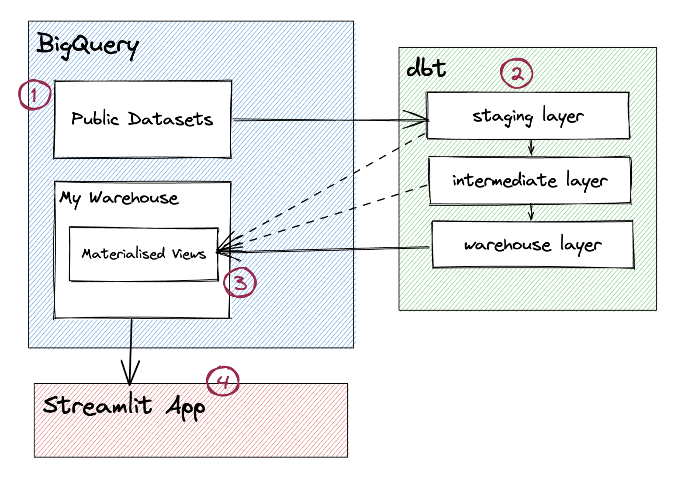

# End-to-end pipeline of Google Trends data with dbt, BigQuery, and Streamlit

This project aims to demonstrate data warehouse transformations within Google BigQuery using dbt, then allowing a Streamlit app to directly access the processed data in BigQuery. I've chosen the Google Trends dataset in BigQuery's public datasets for this project - specifically transforming data from the `international_top_terms` table. This project is only a simulation of a data warehouse project.

## Simple architecture

The illustration below outlines the different interacting parts of this project.

1. The raw data comes from BigQuery's public datasets.
2. The dbt code follows a certain design pattern consisting of three transformation layers: staging, intermediate (sometimes called "integration"), and warehouse layer (sometimes called "data marts"). The staging layer models the raw data and performs some type declarations. The intermediate layer performs the aggregations and other data enrichments to transform the raw data into entities that can address a business problem. The warehouse layer models the finalised entities that the warehouse users will query to answer business problems.
3. The data warehouse contains the materialised views from the different dbt layers.
4. The Streamlit app connects directly to BigQuery using service credentials, queries the warehouse layer's output, then displays the results in the app's front-end.

## Project structure

This project has two main folders:

1. `dbt-project` - contains the dbt code that connects to the BigQuery dataset and performs some transformations to address a business question on the selected dataset.

2. `streamlit-project` - contains the Python code using the Streamlit framework to create and deploy an app. This project is stored in a Github repository, so that if you would like to deploy the app to Streamlit Cloud, you can just reference this repository on the Streamlit Cloud app configuration.

